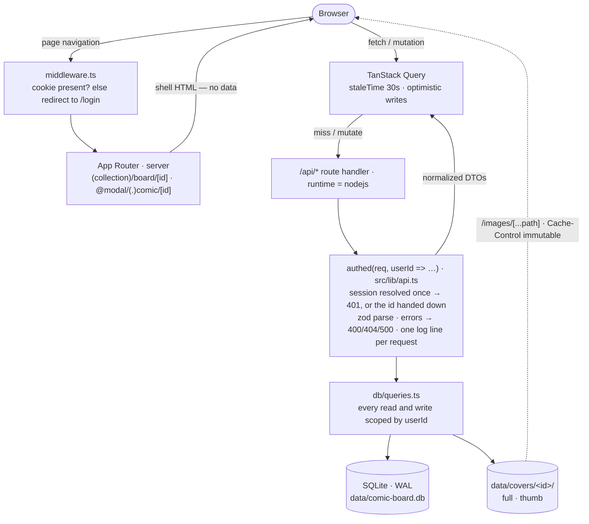

# Architecture

Orientation for someone new to the codebase: how a request travels, which layer
may call which, and the seams the app is built to be cut along.

**Deliberately thin.** This doc holds only what changes when the *shape* of the
app changes, so it drifts slowly. Anything that changes per-feature lives
elsewhere:

| For | Read |
|---|---|
| Setup, scripts, the folder tree | [`README.md`](./README.md) |
| Data model, endpoint list, UI spec, provider references | [`DESIGN.md`](./DESIGN.md) |
| Why a decision went the way it did; bugs and their root causes | [`ENGINEERING_NOTES.md`](./ENGINEERING_NOTES.md) |
| What shipped / what's next | [`CHANGELOG.md`](./CHANGELOG.md), [`ROADMAP.md`](./ROADMAP.md) |

---

## 1. One process, four moving parts

Comic Board is a single Next.js server. It renders the pages, answers its own
`/api` calls, serves cover images off disk, and talks to a SQLite file in
`./data` through Drizzle. No second service, no queue, no object store — so the
whole thing installs with `npm install && npm run dev`.

Most of the code is ordinary CRUD around that spine. The complexity
concentrates in four places, each documented in depth elsewhere:

| Subsystem | The hard part | Detail |
|---|---|---|
| Cover files | Which folder exists and who owns it | `DESIGN.md` §3 *Cover file lifecycle* |
| Board ordering & layout | Reorder must not reflow unrelated cards | `DESIGN.md` §5, `ENGINEERING_NOTES.md` |
| Metadata autofill | The API key must never reach the browser | `DESIGN.md` §4.1 |
| Auth | Two gates that check different things | `DESIGN.md` §4 *The auth gate* |

---

## 2. How a request travels



Three things this makes concrete:

- **The App Router routes; it does not fetch.** Every `page.tsx` resolves its
  `params` and renders a client component — no server component reads the
  database. All data, on first paint and after, arrives through `/api`. The
  practical consequence: if you're looking for where a screen gets its data,
  it's a hook in `lib/client-api.ts`, never the page.
- **`authed()` is the only door.** It resolves the session once, 401s when it's
  absent, maps thrown errors to a status, and emits the request's log line. A
  handler can't forget to log or to check auth, because there's nowhere to
  forget it. Routes that genuinely serve anonymous traffic use `handle()`.
- **Cover bytes bypass all of it.** `/images/[...path]` reads from disk with an
  immutable cache header, so the database is never on the critical path for
  pixels.

---

## 3. The layering rule

The folder tree is in [`README.md`](./README.md#how-its-organized). What that
tree doesn't say is which direction calls are allowed to run:

```
app/          routing, layout, and route handlers only
  ↓
components/   presentation and local interaction
  ↓
lib/          logic — pure where it can be, effectful where it must be
  ↓
db/           the only place that speaks SQL
```

- **Nothing above `db/` imports Drizzle or `better-sqlite3`.** `db/queries.ts`
  is the entire data API, and every function in it takes `userId` as its first
  argument — so failing to scope a read is a type error, not a leak.
- **`lib/` splits in two, and the split is visible in the tests.** The pure
  modules — `reorder`, `positions`, `filters`, `sort`, `stats`,
  `search-suggest`, `nav-order` — have no I/O and carry a `.test.ts` beside
  them. The effectful ones — `storage`, `images`, `backup`, `auth`, `logger` —
  are kept thin, because that's the code a unit test can't reach cheaply.
- **`components/` never talks to `db/`.** It goes through the hooks in
  `lib/client-api.ts`, which is also the one place cache invalidation is
  written down — keys are namespaced by prefix, so invalidating `["comics"]`
  catches every board's list while `["comic"]` refreshes an open detail view.

---

## 4. Seams

Anything that might one day become a network service already sits behind a
one-purpose interface. Each is small enough to reimplement in an afternoon, and
callers never see past it.

| Seam | Shape | Swapping it means |
|---|---|---|
| `StorageAdapter` (`lib/storage.ts`) | `put · delete · deletePrefix · listCoverDirs · getUrl · keyFromUrl · resolve` | An S3/R2 implementation, no caller changes. `resolve` is also where path traversal is blocked. |
| `MetadataProvider` (`lib/metadata/types.ts`) | `search(series, issue) · detail(ref)`, normalized to shared DTOs | A second source alongside Metron. Comic Vine was evaluated and dropped; the seam stayed. |
| `Upscaler` (`lib/upscale/types.ts`) | `run(bytes, scale) → bytes` | A GPU box on the LAN instead of a local binary. Shaped deliberately like `StorageAdapter`. |
| Drizzle + SQLite (`db/client.ts`) | One shared connection, WAL, foreign keys on | Postgres later — the schema uses nothing SQLite-specific. |

The two optional ones share a rule: **a feature gated on configuration is
absent, not broken.** No `METRON_API_KEY` and metadata autofill isn't rendered;
no `UPSCALER_BIN` and the Upscale action doesn't exist. Better than a button
that fails on click.

---

## 5. Invariants that cross files

The ones where a change in one file breaks an assumption in another. Each is
enforced at its own site too, but they're collected here because reading any
single file won't reveal them.

- **A cover folder is owned** if `comics.imagePath` *or*
  `comics.originalImagePath` points at it. Owned by neither, it's an orphan and
  the startup sweep collects it. `originalImagePath` is written once and never
  overwritten, and cleared by a cover replacement. → `DESIGN.md` §3.
- **Derive a comic's cover folder from `imagePath`, never from its id.** They
  match only until the first replacement, which writes to a fresh folder and
  leaves the id alone.
- **Deletion is soft.** Every read filters `deletedAt IS NULL`; a soft-deleted
  comic still owns its files, because undo has to bring them back.
- **Positions are swapped, never inserted.** A drag makes two cards trade exact
  `position` values and writes two rows; new comics append at `max + 1`. This
  is what keeps a reorder correct while a filter is active — hidden comics keep
  their positions. → `ENGINEERING_NOTES.md`, *Swap-on-drop*.
- **Client-supplied storage keys are authorized, not trusted.** Upscale
  accept/discard check `isCoverReferenced` first: a candidate is by definition
  unreferenced, and any key already in use — on *any* account — is refused.
- **Errors are mapped in one place.** Zod → 400 with field detail; a provider or
  upscaler error passes its own status and client-safe message through;
  everything else is logged server-side and reduced to a bare 500. No stack
  hint, binary path, or API key reaches a client.
- **Maintenance runs at startup, not on a request path.** `instrumentation.ts`
  sweeps deleted comics, then orphaned covers — in that order, so the hard
  delete frees folders the orphan pass collects in the same run. It's guarded
  to the Node runtime because the edge bundle evaluates the same file.
