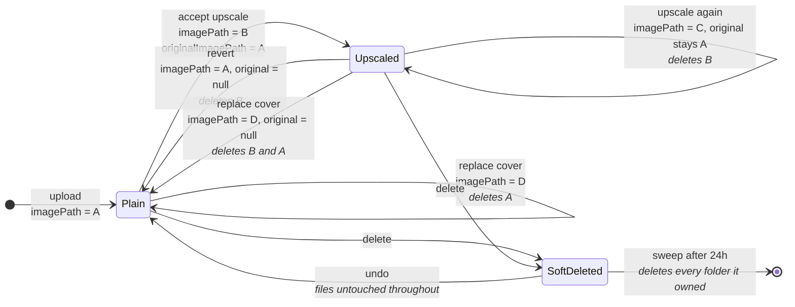
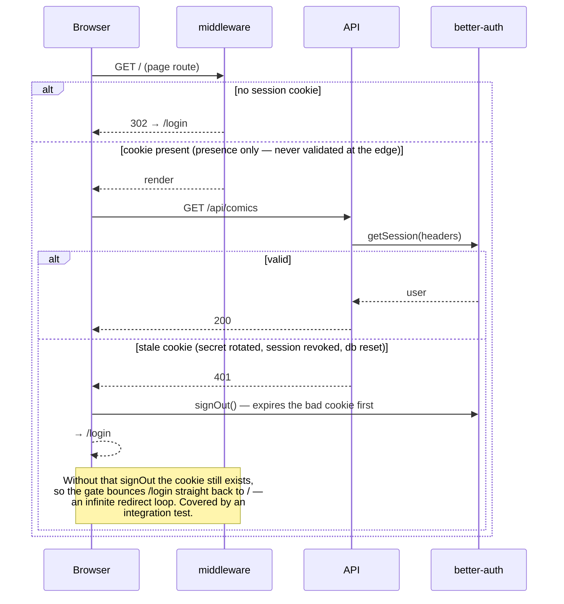

# Comic Board — Design Document

A Pinterest-style app for collecting and browsing comic book covers. Users upload
cover images with metadata, organize them into **boards** shown as tabs, arrange
covers via drag-and-drop, open a shared-element detail view, sort and filter by
any field, and rate their collection. The quality bar is **fluidity**: every
interaction animates smoothly with no layout jank.

This doc tracks both what is **built today** and the **roadmap** toward 1.0.
Sections tagged _(built)_ describe shipped behavior; _(planned)_ describes work
not yet implemented.

---

## 1. Status

**Built (v0.x):** upload + metadata, uniform-grid **virtualized** masonry board,
multiple boards as tabs (create/rename/delete, membership, save-view-as-board),
drag-to-**swap** reorder (per board, works while filtered), shared-element detail
modal with edit/delete, filtering + search +
facets scoped per board, directional sort (dropdown in grid, sortable column
headers in list), normalized + renameable publishers, column-density control,
portal-based overlays, unit + integration tests.

**1.0 landed:** user accounts (email/password) with per-user ownership of comics
& boards, half-star (0.5–5) ratings + sort-by-rating, an editable list view, and
CI (unit + integration). See §8 for the shipped slices; §9 for release status.

**Also shipped post-1.0:** export/backup, Metron metadata autofill on upload,
replace-cover, and (1.1.0) cover upscaling with preview + revert. See [`CHANGELOG.md`](./CHANGELOG.md) for the full history and
[`ROADMAP.md`](./ROADMAP.md) for what's next.

---

## 2. Tech stack

| Layer | Choice | Notes |
|---|---|---|
| Framework | **Next.js 16 (App Router) + React 19 + TypeScript** | One deployable unit: UI + API routes + image serving. |
| Styling | **Tailwind CSS v4** | Design tokens in `src/app/globals.css` (dark, gallery-like). |
| Animation | **Motion (Framer Motion) v12** | `layout` for reflow, `layoutId` for the card→detail shared element. |
| Drag & drop | **@dnd-kit** (core + sortable) | Swap on drop; pointer-precise collision; render windowed to viewport. |
| Database | **SQLite via Drizzle ORM** (better-sqlite3) | Zero-ops; migrates cleanly to Postgres later. |
| Auth | **better-auth** | Email/password; HTTP-only session cookie. |
| Image storage | **Local filesystem** behind a `StorageAdapter` | S3/R2 is a drop-in later. |
| Image processing | **sharp** | full webp + ~500px thumb + tiny blur placeholder on upload. |
| Validation | **zod** | Shared request schemas. |
| Data fetching | **TanStack Query** | Optimistic reorder/edit; cache invalidation. |
| Backup | **fflate** | Zips/unzips the collection export (`collection.json` + covers). |
| Tests | **vitest** (unit) + **puppeteer-core** (integration) | `npm test`, `npm run test:integration`. |

Node 22 LTS pinned in `.nvmrc` (runs on 25 with `typescript.ignoreBuildErrors`
since Next 16's in-build TS checker crashes there; `tsc` runs separately).

---

## 3. Data model

Current tables.

```
Comic
  id            TEXT (nanoid) PK
  userId        TEXT FK → User        -- owner; ON DELETE CASCADE (null = unowned/seed pool)
  series        TEXT NOT NULL
  issueNumber   TEXT                  -- "300", "Annual 1"
  publisherId   TEXT FK → Publisher   -- normalized; ON DELETE SET NULL
  coverDate     TEXT (ISO yyyy-mm-dd) -- full date; day-level
  rating        REAL                  -- 0.5–5 in 0.5 steps; null = unrated
  imagePath, thumbPath, blurDataUrl TEXT NOT NULL
  width, height INTEGER NOT NULL      -- aspect-ratio reservation
  position      REAL NOT NULL         -- My Comics drag order
  createdAt     INTEGER NOT NULL
  deletedAt     INTEGER               -- soft delete; swept ~24h later (undo window)
  originalImagePath TEXT              -- cover an accepted upscale replaced; null = never upscaled

Board            (id PK, userId FK→User, name, tabPosition REAL, createdAt)
BoardComic       (boardId FK, comicId FK, position REAL, addedAt) PK(boardId,comicId)

Author           (id PK, name, nameKey UNIQUE)   ComicAuthor    (comicId FK, authorId FK)
Artist           (id PK, name, nameKey UNIQUE)   ComicArtist    (comicId FK, artistId FK)   -- cover artists
Character        (id PK, name, nameKey UNIQUE)   ComicCharacter (comicId FK, characterId FK)
Tag              (id PK, name, nameKey UNIQUE)    ComicTag       (comicId FK, tagId FK)       -- facsimile, homage, key issue, variant…
Publisher        (id PK, name, nameKey UNIQUE)    -- Comic.publisherId FK; renameable, merges on collision

-- Auth tables (better-auth, in db/auth-schema.ts):
User             (id PK, email UNIQUE, name, emailVerified, createdAt)
Session          (id PK, userId FK, token, expiresAt, …)
Account          (id PK, userId FK, providerId, password hash for email/password, …)
Verification     (id PK, identifier, value, expiresAt)
```

Notes:
- **"My Comics" is virtual** — every comic belongs to it implicitly, ordered by
  `Comic.position`, so it can never be deleted or desynced. Custom boards store
  their own ordering in `BoardComic.position`.
- **Author, Cover Artist, Character, Tag are normalized** (own tables + join +
  case-insensitive `nameKey` dedupe) because they drive filter facets with counts.
- **Publisher is normalized too** (own table, `nameKey` dedupe, `Comic.publisherId`
  FK). Unlike the multi-value catalogs it's a single FK, and it's **renameable in
  place**: renaming updates every comic at once and **merges** onto an existing
  publisher when the new name collides. Writes go through `upsertPublisher`.
- **Notes** and the boolean **facsimile** field were removed; facsimile is now a
  Tag, and free-text notes were dropped in favor of structured catalog metadata.
- Deleting a board removes only its `BoardComic` rows; deleting a comic cascades
  out of every join table and deletes its image files.
### Cover file lifecycle

Diagrammed because this is where the bugs were. Four of the issues found in the
1.1.0 review were about *which folder exists and who owns it* — including one
that let Revert delete a freshly uploaded replacement. A comic's two pointers
are the whole ownership model: a folder referenced by neither is an orphan.



Reading it as invariants:

- **A folder is owned** if `imagePath` or `originalImagePath` points at it. Both
  count — that's why the delete sweep collects two folders, and why the orphan
  sweep treats soft-deleted comics as still owning their files (undo has to be
  able to bring them back).
- **`originalImagePath` is written once and never overwritten**, so upscaling
  twice still reverts to the true original rather than a generated intermediate.
  The corollary is that the superseded *generated* cover becomes unowned at that
  moment and has to be collected right there.
- **A replacement clears it.** The kept original belonged to the cover being
  replaced. Leaving it set kept `upscaled: true` and armed Revert to restore a
  stale image *and delete the one just uploaded*.
- **Anything unowned is an orphan**, whatever the cause — a candidate whose
  dialog was closed mid-run, a crash, a restart. `sweepOrphanedCovers` collects
  them at startup, after a minimum age so it can't take a preview still being
  decided on.

- **`originalImagePath` is what makes an upscale reversible.** It's written only
  while still null, so upscaling twice still reverts to the true original rather
  than a generated intermediate, and it's cleared by `replaceComicCover` — a
  replacement supersedes any upscale history, and leaving it set would arm
  Revert to delete the image just uploaded. Cover files are owned by whichever
  of `imagePath` / `originalImagePath` points at them; anything else is an
  orphan and `sweepOrphanedCovers` collects it at startup.

---

## 4. API

Next route handlers under `/api`; zod-validated, 400 with field errors on failure.

| Method & path | Purpose |
|---|---|
| `GET /api/comics?board=<id>` | List comics (joined authors/artists/characters/tags + board memberships), ordered by position. |
| `GET /api/comics/:id` | Fetch a single comic (joined relations) — the detail view / deep link. |
| `POST /api/comics` | Multipart upload: image + metadata JSON (+ optional `boardIds`). |
| `PATCH /api/comics/:id` | Update metadata (series, issue, publisher, coverDate, authors, artists, characters, tags[, rating]). |
| `PUT /api/comics/:id/cover` | Replace the cover image (a new upload, or a Metron pull); regenerates full/thumb/blur and repoints the comic, keeping metadata + board memberships. |
| `DELETE /api/comics/:id` | Delete row + memberships + image files. |
| `PATCH /api/comics/:id/position` | `{ position, boardId? }` — single-row reorder. A drag **swap** issues two of these (the two cards trade positions). |
| `GET/POST /api/boards`, `PATCH/DELETE /api/boards/:id` | Board CRUD (POST accepts `comicIds` for save-view). |
| `PUT/DELETE /api/boards/:id/comics/:comicId` | Add / remove membership. |
| `PATCH /api/publishers` | `{ from, to }` — rename a publisher (applies to all its comics; merges on collision). |
| `GET /api/meta` | Global distinct values + counts — powers **form autocomplete**. |
| `GET /api/metadata` | List configured metadata providers (Metron) + the default. |
| `GET /api/metadata/search` | Search a provider for candidates — backs the upload flow's smart search box. |
| `GET /api/metadata/detail` | Fetch the full record for one search candidate (prefills the form). |
| `GET /api/metadata/cover` | Proxy a provider's cover image (keeps the provider API key server-side). |
| `GET /api/export` | Stream a zip backup (`collection.json` + every cover) — see "Backup & restore" in `README.md`. |
| `GET /api/upscale` | Whether an upscaler is configured — gates the UI, like `/api/metadata` does for autofill. |
| `POST /api/comics/:id/upscale` | Generate an upscale candidate and return it for preview. Does **not** touch the comic. |
| `PUT /api/comics/:id/upscale` | Accept a candidate, keeping the cover it replaces so it stays revertible. |
| `DELETE /api/comics/:id/upscale` | Discard a declined candidate's files. |
| `POST /api/comics/:id/upscale/revert` | Restore the kept pre-upscale cover and delete the generated one. |

### Upscale: nothing is committed until you accept

The non-obvious part is that the candidate is a **real stored image before
anyone decides its fate** — that's what makes preview possible, and also what
makes orphans possible.

```mermaid
sequenceDiagram
    actor User
    participant Dialog as UpscaleDialog
    participant API as /api/comics/:id/upscale
    participant Bin as Real-ESRGAN
    participant FS as storage
    participant DB

    User->>Dialog: Upscale
    Dialog->>API: POST (runs on open — no confirm step)
    API->>FS: read current cover
    API->>Bin: run(bytes, 4x)
    Bin-->>API: enlarged PNG
    API->>FS: processUpload → covers/&lt;new&gt;/ (full + thumb + blur)
    API-->>Dialog: candidate { imagePath, url, size }
    Note over DB: the comic is UNCHANGED at this point

    alt Keep it
        Dialog->>API: PUT { imagePath }
        API->>DB: imagePath = new, originalImagePath = old
        Note over FS: the outgoing cover is KEPT — it is the backup
    else Discard
        Dialog->>API: DELETE { imagePath }
        API->>FS: remove covers/&lt;new&gt;/
    else Closed mid-run, crash, restart
        Note over FS: candidate stranded — no cleanup code can run.<br/>sweepOrphanedCovers collects it at startup.
    end
```

Accept and discard take an `imagePath` supplied by the *client*, so both
authorize it with `isCoverReferenced`: a candidate is by definition unreferenced,
and any key already in use — a live cover or a kept original, **any account's** —
is refused. Without that, a crafted path could repoint one comic at another's
artwork, or delete a live cover.
| `GET /images/[...path]` | Serve stored covers, `Cache-Control: immutable`. |
| `ALL /api/auth/[...all]` | better-auth handler (sign-up / sign-in / sign-out); HTTP-only session cookie. |

All non-auth routes resolve the session and **401 when absent**; every query is
scoped to that user id. In practice that means wrapping the handler in
`src/lib/api.ts`'s `authed(req, (userId) => …)`, which resolves the session once
and 401s for you — the plain `handle(req, …)` form below is for routes that
genuinely serve anonymous requests.

### The auth gate, and the loop it used to cause

Two layers that check different things, which is easy to misread as redundancy:
the middleware is **edge-safe and only checks that a cookie exists**, while the
API does real session validation. The gap between them produced a real bug.



**Request logging:** every route above except the auth catch-all goes through
`src/lib/api.ts`'s `handle()`/`authed()` wrappers, which — beyond mapping thrown errors to
the right status — logs one JSON line (`method`, `path`, `status`, `ms`,
`userId`) per request to `DATA_DIR/logs/<date>.log`, one file per calendar day,
7 days kept (`winston` + `winston-daily-rotate-file`, `src/lib/logger.ts`). The
auth catch-all owns its own request/response cycle end-to-end, so it gets a
thin equivalent wrapper instead, POST-only (this app's only GET traffic there
is `get-session` polling, logged nowhere near as usefully as an actual
sign-in). Everything else server-side logs to the same place and no runtime
code uses `console.*`: the Metron provider (§4.1) writes `metron.detail` and
`metron.budget`, `handle()` writes `api.error` (message + stack server-side; the
client still gets a bare "Internal error"), and the startup sweep writes
`startup`. Outside production a console transport mirrors every line to the
terminal, so persisting costs nothing at-a-glance. The `src/db/*` CLI scripts
are the deliberate exception — their stdout is their user interface.

Restoring a backup is a CLI, not a route — `npm run db:import <zip> --
--replace` recreates comics/boards via the normal upload pipeline
(`src/db/import.ts`); see `README.md` for the full recipe.

**Facet counts vs. autocomplete:** filter dropdown facets are computed
**client-side from the current board's comics** (`computeFacets`) so counts match
what's on screen; `/api/meta` supplies the **global** suggestion list for the
upload/edit form. Filtering/sorting run client-side for instant animated reflow;
the `board` param scopes the list server-side.

### 4.1 Metadata provider reference

Captured from live API responses so recalling a shape doesn't cost rate limit.
The provider sits behind `MetadataProvider` (`types.ts`) and is normalized to
`MetadataCandidate` / `MetadataDetail`.

The app uses **Metron exclusively** (Comic Vine was evaluated and dropped — its
search results were weaker). The abstraction remains so another source could be
added. Key lives in `.env`, never sent to the client: `METRON_API_KEY`.

**Metron — https://metron.cloud/api**

- **Auth:** `Authorization: Bearer <token>`. Tokens don't expire; managed and
  revocable at metron.cloud. (Older docs mention HTTP Basic — we use Bearer.)
- **Grain:** search is **issue**-level, so candidates are concrete issues.
  Detail fills in credits / covers / publisher.
- **Rate limit:** two token buckets, on **every** response as headers.
  `x-ratelimit-burst-limit: 20` (+ `-burst-remaining`, `-burst-reset` in epoch
  seconds) is a short-term burst; `x-ratelimit-sustained-limit: 5000` (+
  `-sustained-remaining`, `-sustained-reset`) is 5000/day. Read them live and
  back off when burst-remaining is low; a 429 carries `Retry-After`.
- Paginated: `{ count, next, previous, results: [...] }`.

Endpoints used:

1. **Issue search** — `/issue/?series_name=<series>&number=<n>`, returning
   `{ id, series: { id, name, volume, year_began }, number, issue, cover_date,
   store_date, image }`.
2. **Issue detail** — `/issue/<id>/`:
   - `series: { name, year_began }`, `number`, `publisher: { name }`.
   - **Dates:** `cover_date` (printed) *and* `store_date` (on-sale). The printed
     date runs ~2 months ahead of release.
   - `credits[]`: `{ creator: "Stan Lee", role: [{ name: "Script" }, …] }` —
     role is an **array of objects**.
   - `image`: primary cover URL, on `static.metron.cloud`.
   - `variants[]`: `{ name, image, price, sku, upc }` — labeled variant covers
     with **no creator attribution**, so a cover artist can't be tied to a
     specific variant. Coverage is community-contributed and **lags new
     releases**; `[]` on a recent issue is normal, not a bug (see ROADMAP 4h).
   - `characters[]`: present but **unused** — unreliable.
- Cover images are on `static.metron.cloud`, the only host allowlisted in the
  cover proxy (`covers.ts`).

**Normalization** (`normalize.ts` + `metron.ts`):

- **Date** = `store_date` when present, else `cover_date` — release is what we
  surface, since the printed date runs ahead.
- **Authors** = credits whose role matches `writer | script | plot` (Metron
  labels the writer "Script").
- **Cover artists** and **characters** are deliberately **not** autofilled — see
  the variant-attribution and reliability notes above.
- **Covers** = primary `image` first (labeled "Main cover"), then `variants[]`
  (label = variant `name`, else "Variant N"); de-duped by URL.
- **Cover date** → strict `yyyy-mm-dd`: `"1963-03-00"` → `-01`; year-month or
  year-only pad to `-01`; anything else → `null`.
- Name lists are trimmed and de-duplicated case-insensitively, order preserved.

---

### 4.2 Upscaler reference

**Optional and off by default.** Set `UPSCALER_BIN` and the detail view grows an
Upscale action; leave it unset and the action isn't rendered at all — the same
gating `METRON_API_KEY` gives metadata autofill, and better than a button that
errors on click.

**Why it exists.** The median stored cover is ~600px wide (334 of 392 were under
700px when the feature was built), because most arrive through Metron's "Use
this cover" and its CDN images are around that size. The detail modal shows a
cover at roughly 480 CSS px, which on a retina display wants ~960 real pixels —
so 600px is about half of what the app displays it at. The app's own 1600px
upload cap was never the binding constraint: only 6% of covers reach it.

**The engine.** Real-ESRGAN via an ncnn/Vulkan binary — GPU-accelerated through
Metal on Apple Silicon, no Python runtime. It sits behind a one-method
`Upscaler` interface (`src/lib/upscale/types.ts`), shaped deliberately like
`StorageAdapter`: `run(bytes, scale) → bytes` and nothing else, so a different
backend (a GPU box on the LAN) is a drop-in without callers changing.

- **Binary:** upstream Real-ESRGAN has no Homebrew formula. `.env.example`
  points at Upscayl's bundled ncnn binary (`brew install --cask upscayl`) —
  the GUI is only a wrapper; the binary and its models run standalone.
- **Model:** `digital-art-4x` by default, the illustration model in Upscayl's
  set. Comic covers are line art and flat colour, which is the domain these
  models handle best; photo models smear inked linework. Upstream builds name
  theirs `realesrgan-x4plus-anime` instead — hence `UPSCALER_MODEL`.
- **Scale:** the models are **4×-native**. The UI offers only 4×; the API still
  accepts 2, which is produced by running the model natively and resampling its
  output down — the invented detail survives the downsample and reads sharper
  than a true 2× model would. Reintroducing a selector is a UI change, not a
  server one.
- **Ceiling:** every result is capped at `MAX_UPSCALE_WIDTH` (2400px), shared by
  the route and the dialog from one constant so the preview can't promise a size
  the server won't store. 4× a typical 600px cover lands there naturally, but as
  a *cap* it also stops an already-1600px scan becoming a 6400px file that's slow
  to produce, heavy to store and no sharper on screen. Width is the capped axis
  because the board is a fixed-column masonry — horizontal resolution is what
  determines sharpness in the grid — so height follows the source aspect ratio
  and varies per cover.
- **File I/O:** the binary is file-in/file-out with no stdin/stdout mode, so
  each run uses a temp dir under the OS temp root (not `DATA_DIR`, so a crashed
  run leaves nothing in the collection) removed in a `finally` either way.
- **Timeout:** 120s, so a wedged GPU can't hang the request. stderr is logged
  under `tag: "upscale.error"` and never returned — it names the binary path and
  model dir.

**The honest limitation, stated in the UI too:** at these source sizes the model
*invents* plausible detail rather than recovering what was lost. On comic line
art it generally holds up, but for a cover that matters a real high-resolution
scan through **Replace cover** beats any upscale.

## 5. UI & interaction (built)

- **Board tabs** — pinned "My Comics" + custom boards + "+", then a divider and
  **Stats** as a trailing peer; sliding active indicator (`layoutId`); per-tab
  "…" menu (Rename/Delete) rendered in a portal so the scrollable/blurred tab
  strip can't clip it. Routes: `/`, `/board/[id]`, `/stats`.
- **Persistent chrome** — the header, tab strip and upload modal live in a
  `(collection)` **route-group layout** (`CollectionChrome`), not inside each
  page, so navigating between the board, a custom board and stats swaps only
  `<main>`. Rendering them per-page rebuilt the entire header on every
  transition, which read as a full page reload and — by destroying the Motion
  tree mid-navigation — stopped the tab underline animating at all. Route groups
  don't affect URLs, and the `@modal` interceptor stays at the root level.
- **Masonry** — **fixed-column** layout (`i % columns`), not shortest-column, so
  reordering never reshuffles unrelated cards. Cards are a **uniform height**
  (standard comic ratio, object-cover) for aligned rows; positions animate via
  transforms. Column count is responsive with a user **density control** (Auto/3/4/5/6).
  **Virtualized:** only cards intersecting a buffered viewport window are mounted
  (`placementsInRange`, ~one screen of overscroll), while the container keeps its
  full computed height so the scrollbar and layout are unaffected. The full board
  still lives in memory, so filter/sort/facets/drag/modal-nav are unchanged — only
  DOM node count is bounded. The entrance stagger plays once on load, not per
  scroll-in.
- **Cards** — blur placeholder → thumb crossfade; hover shows series + issue and a
  "…" menu (add-to-board checklist, remove-from-board, delete). Full cover is
  preloaded on pointer-enter so the detail modal opens on a decoded image.
- **Drag reorder** — dnd-kit, 8px activation, **swap on drop**: the dragged card
  and its drop target trade exact `position` values; every other card stays put
  (no shift/insert). Pointer-precise collision; per-board persistence via two
  optimistic position writes. Works **while filtered** (the two
  visible cards swap; hidden comics keep their positions). Core swap is the pure
  `swapReorder` (`src/lib/reorder.ts`).
- **Detail modal** — route-backed intercepting modal with shared-element cover,
  clickable facet chips (apply filter), boards membership, ←/→ nav, inline-confirm
  delete, and **edit mode** (the metadata panel becomes the shared `MetadataForm`).
  Clicking any display field (series, issue #, publisher, cover date, author,
  cover artists, characters, tags) jumps straight into edit mode with that field
  focused, instead of requiring the separate Edit button first. **Replace cover**
  (upload a file, or pull a Metron cover/variant via `ReplaceCoverDialog`) is
  always visible on the cover image, not gated behind edit mode.
- **Filter + search + sort** — facet dropdowns (Publisher, Author, Cover Artist,
  Character, Tag), a **date-range calendar**, debounced search; URL-backed
  (shareable). The **Publisher** facet is renameable inline (hover-pencil → commit,
  applies to all its comics). **Sort** is **directional** (`?sort=&dir=`): Manual /
  Cover date / Date added / Rating / Series, each asc/desc — default is **Cover date
  on My Comics** and **Manual on custom boards**; drag enabled only in Manual. In
  **grid** the sort is a dropdown; in **list** the column headers sort (click to
  sort, click again to flip direction) and the dropdown is hidden. Animated reflow
  via Motion `layout`.
- **Upload** — defaults to a **Metron search** tab (`MetadataSearch`): one smart
  search box parses the issue number out of the query, results sort
  newest-series-year-first, and picking one prefills series/issue/cover
  date/publisher/creators and imports the cover (main + labeled variants). A
  **manual** tab falls back to the drag-drop zone with local preview. Either way,
  a multi-file queue carries series/publisher/authors/artists/boards forward
  across files, with board pre-selection.
- **Stats** (`/stats`) — headline totals, publisher bars, a rating histogram, a
  release-year timeline, a best-rated cover artists panel (mean rating, floored
  at `MIN_RATED_COVERS` rated covers so a single 5★ can't top it), and
  series/artist/author/character leaderboards. **No API route of its own:** the maths is pure
  (`src/lib/stats.ts`) over the comics list `useComics()` already caches, the
  same client-side-bucketing choice as `computeFacets`. Time is keyed off
  `coverDate` (a property of the collection), never `createdAt` (an artifact of
  when you uploaded). Every breakdown sums to the collection — "No publisher",
  "Unknown", "Unrated" and "Other" buckets exist so bars can't quietly fail to
  add up. Bars are `<a>`s built via `filtersToParams`, so drill-through can't
  drift from the board's URL contract; the rating histogram links too, through
  the board's `rating` facet, and both sides bucket via the same `ratingBucket`
  so a bar's count and the board it opens can't disagree. Vertical bars are
  sized against a fixed plot height, never a percentage of a box that also
  holds their labels — see `ENGINEERING_NOTES.md` for what that cost. Charts
  are hand-rolled divs + one inline SVG — no
  charting dependency. Reached from **a trailing item in the board tab strip**,
  after the `+` and behind a divider, which takes the normal active highlight —
  so exactly one item in the strip is always current and getting back to the
  covers is "My Comics", where it is on every page. It deliberately carries no
  count: a number would imply the stats are scoped to a subset, when they're
  always the whole collection. Two earlier arrangements were worse and are
  recorded in `ENGINEERING_NOTES.md`: no strip at all (a dead end), then the
  strip with nothing highlighted (a zero-selection state that reads as broken,
  and — since every board tab carries a count — as a scope selector for a page
  made entirely of counts).
- **Overlays** — `Dialog` and `Menu` render through React portals to `document.body`
  so ancestor `overflow`/`backdrop-filter` never clips or mis-positions them.

### Fluidity acceptance criteria
Only animate transform/opacity; no CLS from image loads (dimensions reserved);
click vs. drag never misfires; shared-element open/close is continuous; springs
for movement, durations for fades.

---

## 6. Testing

- **Unit (`npm test`, vitest):** pure logic — `applyFilters`, `computeFacets`,
  filter URL round-trip, directional `sortComics`, position append (`positionAfterMax`), masonry math
  **+ `placementsInRange` windowing**, **`swapReorder`** (swap-not-insert, symmetry,
  fractional positions, no-op drops), normalized-publisher queries (dedupe/rename/
  merge), search-suggestion ranking, **`computeStats`** (bucketing, gap-filled
  decades and release years, defensive rating snapping, and the invariant that
  every breakdown sums to the collection), id/name helpers, **`handle()`'s
  request logging** (spies `logger.info`, since it would otherwise write a real
  line to `data/logs` on every test run — a logging failure must never break
  the actual response, asserted directly), **`authed()`'s 401 short-circuit and
  single session resolution**, and **storage-key mapping** (`coverDir`, the
  url↔key round-trip, and `resolve()`'s path-traversal rejection).
- **Integration (`npm run test:integration`, puppeteer):** drives the real app in
  a headless browser against an **isolated** db (`./data/test`), port 3940, and
  build dir (`.next-itest`), all torn down after — never touches dev data. Covers
  filter-click rendering, board-scoped facet counts, **that the masonry virtualizes
  (mounts a viewport subset)**, drag-swap persistence, publisher rename, the detail
  modal (incl. scroll-lock + preserved board scroll), edit persistence, per-board
  sort defaults, sortable list headers, and portal overlays. Assertions about "how
  much is on a board" read the app's **"N covers" counter**, not mounted DOM nodes
  (which are now windowed).
- **CI (§8.4):** GitHub Actions on push/PR — one job runs install → `tsc --noEmit`
  → unit tests → build; a second job runs the integration suite in headless Chrome.

---

## 7. Project structure

```
src/
  app/            page.tsx (My Comics), board/[id], comic/[id],
                  @modal/(.)comic/[id] (intercepted), login/, signup/,
                  api/* (incl. auth/[...all], export, metadata/*), images/[...path]
  middleware.ts   optimistic cookie gate for page routes
  components/     board/ (Masonry+layout, ComicCard(+Menu), BoardTabs, BoardView,
                          ListView, TopBar, Sort/Column/View selectors),
                  detail/ (ComicDetail, ReplaceCoverDialog),
                  filters/ (FilterBar, MultiSelect, DateRangeFilter),
                  upload/ (UploadModal, MetadataSearch),
                  forms/ (MetadataForm), auth/ (AuthForm), ui/ (Dialog, Menu,
                          TagInput, Autocomplete, StarRating, Toast, BottomSheet,
                          icons)
  db/             schema, auth-schema, client, queries, migrations, seed, import
  lib/            storage, images, positions (append-after-max), reorder (swap),
                  filters, sort, auth, backup (export/import zip),
                  metadata/ (Metron provider, cache, cover proxy, normalizer),
                  use-* hooks, schemas (zod), types (DTOs)
tests/            integration.mjs
data/             sqlite + covers/ (gitignored)
```

---

## 8. Roadmap toward 1.0

Ordered; each is a self-contained slice.

### 8.1 Accounts & ownership (email/password) — _done_
- **better-auth** (email/password) with the Drizzle/sqlite adapter; `user`,
  `session`, `account`, `verification` tables. Sessions in an HTTP-only cookie.
- Nullable `userId` FK on `comics` and `boards`. **The seed creates the owner
  first** (known creds via `SEED_USER_EMAIL`/`SEED_USER_PASSWORD`, defaults in
  `seed.ts`) and seeds the whole collection under them. A
  `databaseHooks.user.create.after` hook remains as a safety net: the first
  account claims any genuinely unowned rows (e.g. a real pre-auth migration).
- **Scoping:** every query in `db/queries.ts` takes a `userId` and filters/sets by
  it (a null userId = the unowned pool for seeding). API routes resolve the
  session via `authed()` and 401 when absent.
- **UI:** `/signup` and `/login` pages, a user menu with logout in the top bar,
  `middleware.ts` optimistic cookie gate redirecting unauthenticated page views to
  `/login`, and a client 401 → `/login` redirect.

### 8.2 Ratings (half-star, 0.5–5) — _done_
- `Comic.rating` (0.5–5 in half steps, null = unrated). `PATCH /api/comics/:id` accepts it.
- **UI:** a star control in the detail modal + editable list view; clicking sets/clears.
- **Sort:** **Rating** is a directional sort option (unrated sinks last in both
  directions); a rating facet/filter is a later nicety.

### 8.3 List view with inline row editing — _done_
- A **grid ⇄ list** view toggle in the board toolbar (`useView`, persisted in
  localStorage like column density). Column density control hides in list mode.
- List view: a table of rows (thumbnail → detail, series, issue, publisher, cover
  date, authors, cover artists, tags, **rating stars**, row "…" menu). Every field
  is **editable in place** — click-to-edit text/date cells, inline `TagInput` for
  the multi-value fields, always-live `StarRating` — saving through
  `PATCH /api/comics/:id` with the modal edit's optimistic-cache flow. No modal.
- Sorting/filtering/search apply identically to both views (both render `filtered`).

### 8.4 CI — _done_
- GitHub Actions on push/PR: a `build` job runs install, `tsc --noEmit`,
  `npm test`, `npm run build`.
- A second job runs `npm run test:integration` in headless Chrome (provisioned
  via a setup-chrome step) against the isolated test DB/port.

### 8.5 Later

Design-for-later work now lives in [`ROADMAP.md`](./ROADMAP.md), tracked in
one place instead of drifting out of sync with it.

---

## 9. Release

- **1.0** = accounts + ownership (§8.1 ✓), ratings (§8.2 ✓), list view (§8.3 ✓),
  CI (§8.4 ✓), on top of the shipped board experience — **all landed**.
- On `main`, CI green. Ready to tag `v1.0.0`.
