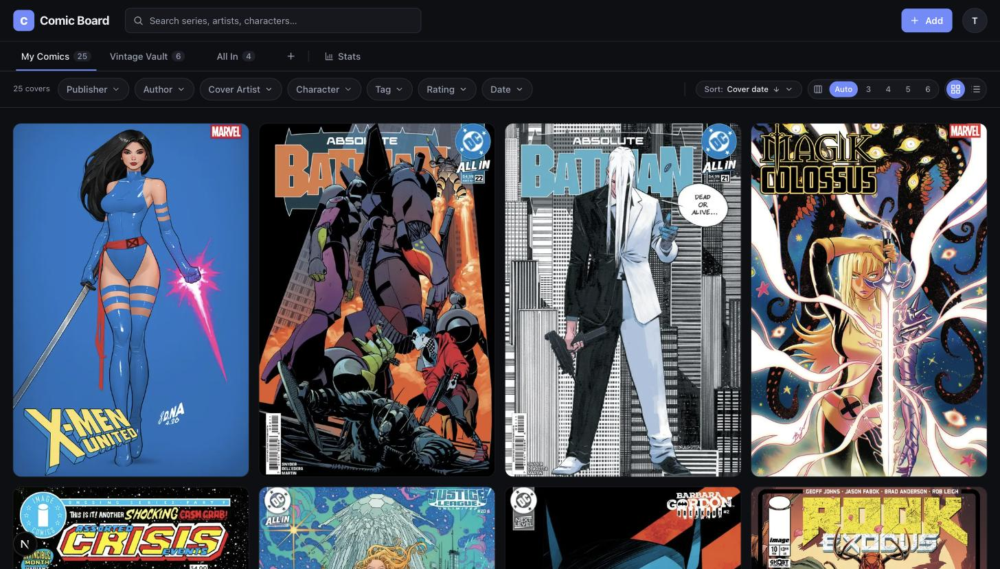
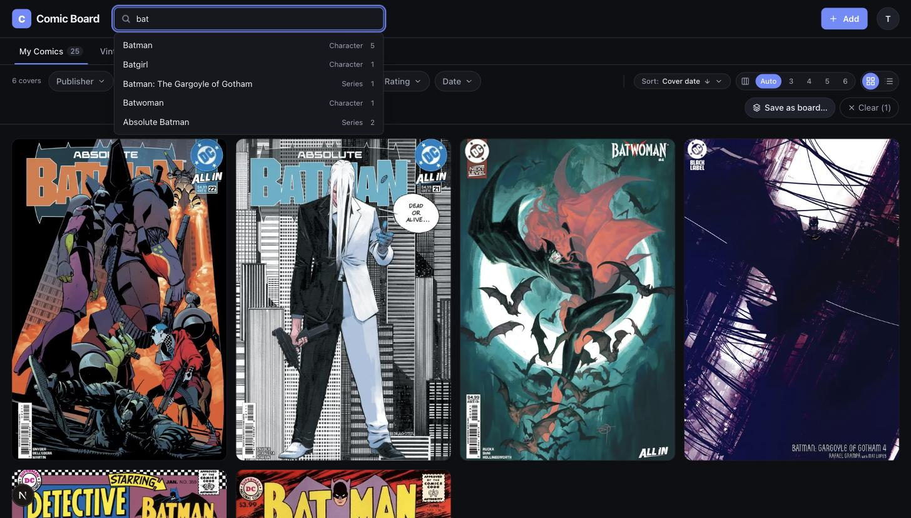
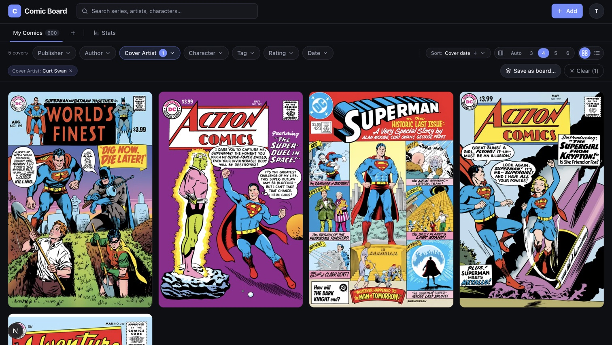
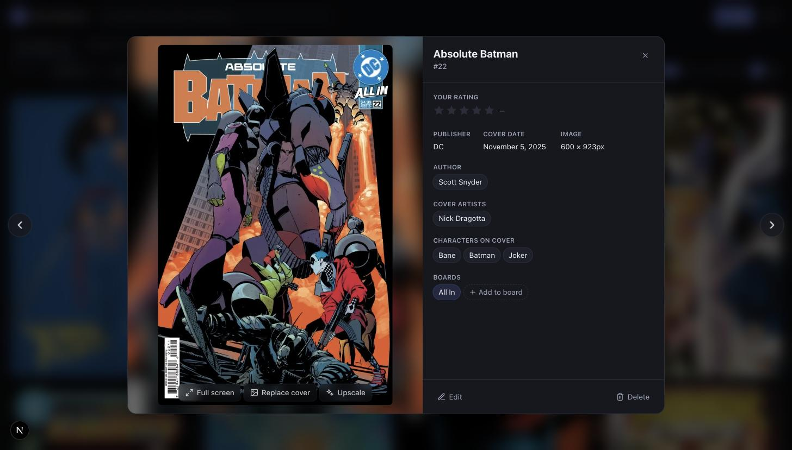
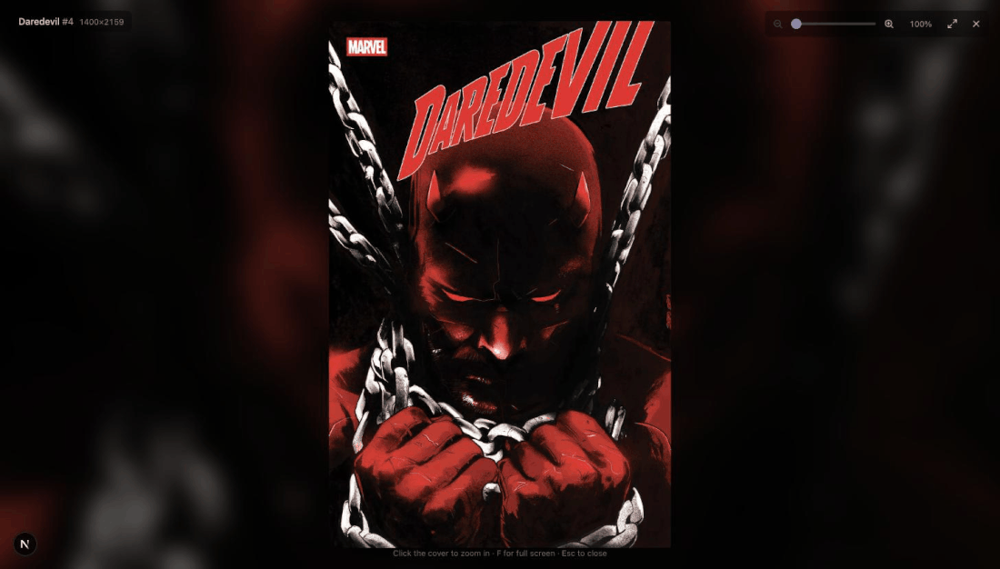
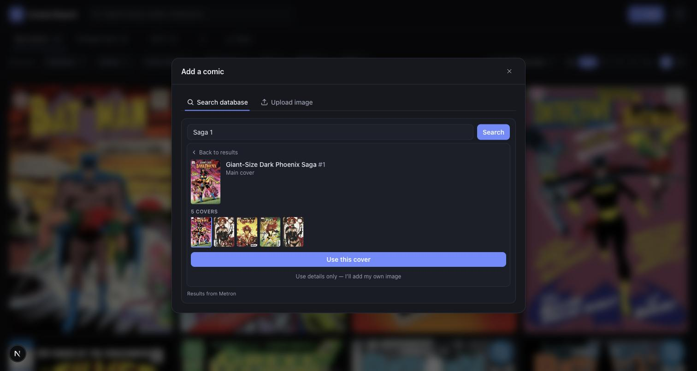
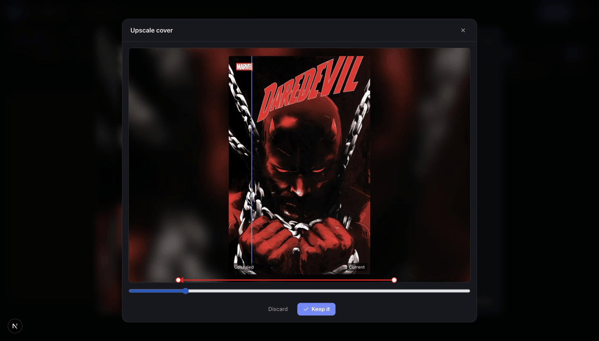

# Comic Board

A Pinterest-style board for collecting and browsing comic book covers. Upload
covers with metadata (series, issue, cover date, artists, characters), organize
them into boards shown as tabs, drag to reorder, click for a shared-element
detail view, and filter by any field with animated reflow.

Built to the spec in [`DESIGN.md`](./DESIGN.md). New to the codebase?
[`ARCHITECTURE.md`](./ARCHITECTURE.md) is the orientation — how a request
travels, which layer calls which, and the seams it's built to be cut along.



Typeahead search suggests series, artists, and characters as you type, and
every filter-bar facet (publisher, author, artist, character, tag, rating,
date) narrows the grid live:




Click a cover for the detail view, then **Full screen** to zoom past fit up
to 1:1 — scroll to pan, pinch or the slider to zoom, `F` for real full-screen:




## Stack

- **Next.js 16** (App Router) + React 19 + TypeScript
- **Tailwind CSS v4** — design tokens in `src/app/globals.css`
- **Motion** (Framer Motion) — layout animations, shared-element transitions
- **@dnd-kit** — accessible drag-and-drop reorder
- **SQLite + Drizzle ORM** (`better-sqlite3`) — zero-ops local persistence
- **better-auth** — email/password accounts + HTTP-only session cookie
- **sharp** — thumbnail + blur-placeholder generation on upload
- **Real-ESRGAN** (optional, external binary) — cover upscaling; see below
- **TanStack Query** — data fetching with optimistic updates
- **zod** — shared request validation

## Requirements

- Node 22 LTS is pinned in `.nvmrc`. The app also runs on Node 25, with one
  caveat: Next 16's in-build TypeScript-check worker crashes on Node 25, so
  `next build` is configured to skip that step (`typescript.ignoreBuildErrors`)
  and we run `tsc --noEmit` separately. On Node 22 you can drop that flag.

## Getting started

```bash
npm install
npm run db:migrate   # create the SQLite schema
npm run db:seed      # load sample covers (uses real images in ./images)
npm run dev          # http://localhost:3939
```

The app requires sign-in. The seed creates an owner account — log in with
`SEED_USER_EMAIL` / `SEED_USER_PASSWORD` (defaults in `src/db/seed.ts`), or
register a new one at `/signup`. In production, set `BETTER_AUTH_SECRET` (the
app refuses to boot without it).

> **Port must match `BETTER_AUTH_URL`.** better-auth only accepts sign-in from
> that origin (`.env`), so the dev server must run on the same port or login
> fails with `Invalid origin`. Both default to **3939** — change one, change
> the other.

Uploaded images and the SQLite database live under `./data` (gitignored).

## How it's organized

```
src/
  app/
    page.tsx                    # My Comics board
    board/[id]/page.tsx         # a custom board
    comic/[id]/page.tsx         # full-page detail (deep link)
    @modal/(.)comic/[id]/       # intercepted detail modal (shared-element)
    login/, signup/             # auth pages
    api/                        # route handlers (comics, boards, meta, images, auth)
  middleware.ts                 # optimistic cookie gate for page routes
  components/
    board/    # Masonry (layout + dnd), ComicCard, BoardTabs, BoardView, ListView
    detail/   # ComicDetail modal
    filters/  # FilterBar, MultiSelect, save-as-board
    upload/   # UploadModal (drag-drop, multi-file queue)
    forms/    # MetadataForm (shared by upload + edit)
    auth/     # AuthForm (login/signup)
    ui/       # Dialog, Menu, TagInput, Autocomplete, StarRating, Toast, icons
  db/         # Drizzle schema (+ auth-schema), client, queries, migrations, seed
  lib/        # storage adapter, image processing, reorder (swap), filters, auth
```

## Metadata autofill

Optional, off unless configured. The Add-comic modal's **Search database** tab
looks up a series/issue against [Metron](https://metron.cloud/) and fills in
publisher, cover date, artists, characters, and cover/variant images. Coverage
is community-contributed, so new releases can come back thin.



Without a key, that tab isn't rendered — just the plain upload flow. Enable it
with a free [metron.cloud](https://metron.cloud/) account:

```
METRON_API_KEY=your-token   # from Metron's account settings
```

## Upscaling covers

Optional, off unless configured. Covers from metadata providers are often
~600px — about half what a retina detail view wants — so the detail modal
offers **Upscale**: runs the cover through a local Real-ESRGAN model, previews
it against the original with a draggable divider, and commits nothing until
you accept. The replaced cover is kept, so **Revert** always works.



Every upscale caps at 2400px so the collection stays consistent. Sort by
**Size** in list view to find covers worth doing.

The app just shells out to whatever binary `UPSCALER_BIN` points at — not
macOS-specific — but you need a Real-ESRGAN ncnn/Vulkan binary first. Easiest
on macOS is the Upscayl app (bundled binary + models, no Homebrew formula
upstream):

```bash
brew install --cask upscayl
```

Then in `.env` (see `.env.example` for alternatives):

```
UPSCALER_BIN=/Applications/Upscayl.app/Contents/Resources/bin/upscayl-bin
UPSCALER_MODEL=digital-art-4x
UPSCALER_MODEL_DIR=/Applications/Upscayl.app/Contents/Resources/models
```

**Linux/Windows**: Upscayl ships desktop builds for both, or grab a binary
from [Real-ESRGAN-ncnn-vulkan releases](https://github.com/xinntao/Real-ESRGAN-ncnn-vulkan/releases)
— upstream names the model `realesrgan-x4plus-anime` and usually finds its
own model dir.

**macOS**: runs Vulkan over Metal — check Upscayl's system requirements if
you're on an older Mac.

> These models **invent** detail rather than recover it. Comic line art
> usually holds up, but for a cover you care about, a real scan via
> **Replace cover** beats any upscale.

## Backup & restore

Export the whole collection as a zip — a `collection.json` manifest plus every
cover's `full.webp` — from the account menu (**Export backup**) or
`GET /api/export`. One click before any risky operation.

`db:import` restores a backup zip. It's a **replace**: wipes the target
account's comics, boards, and covers, then rebuilds them (regenerating
ids/thumbnails/blur via the normal upload pipeline). Refuses to run without
`--replace`:

```bash
IMPORT_USER_EMAIL=you@example.com npm run db:import path/to/backup.zip -- --replace
```

The `--` is required so npm forwards the flag. The target account
(`IMPORT_USER_EMAIL`, falling back to `SEED_USER_EMAIL`) must already exist —
this restores, it doesn't sign up.

## Roadmap

See [`CHANGELOG.md`](./CHANGELOG.md) for what's shipped and
[`ROADMAP.md`](./ROADMAP.md) for what's planned next.

## Contributing

See [`CONTRIBUTING.md`](./CONTRIBUTING.md) for commit conventions and the PR process.

## License

[MIT](./LICENSE)
